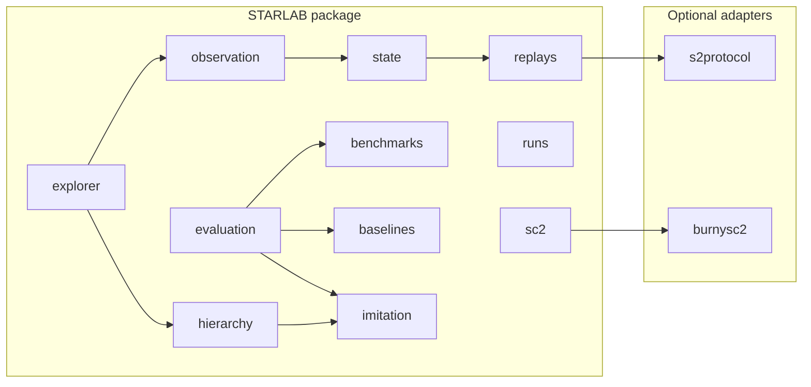

# STARLAB — Architecture Overview

**Authority:** This document orients engineers and reviewers. The canonical public ledger is `docs/starlab.md`; runtime contracts live under `docs/runtime/`.

## System diagram

## Allowed dependency direction (informal)

Flows generally move **from replay-derived data toward evaluation and evidence surfaces**, with **adapters** at the edges:

- **`starlab.replays`** may depend on **`s2protocol`** only through the isolated adapter; upstream milestone code should not import parser internals directly.  
- **`starlab.state` → `starlab.observation`** — canonical state feeds observation / bridge / audit paths (see runtime contracts per milestone).  
- **`starlab.benchmarks`** is consumed by **`starlab.baselines`** and **`starlab.evaluation`**.  
- **`starlab.imitation`** feeds learned baselines and hierarchical agents; **`starlab.hierarchy`** and **`starlab.explorer`** sit toward the **operator / evidence** side.  
- **`starlab.sc2`** is for runtime probe / harness / drift — treat as **optional** for fixture-only CI; live adapters stay behind boundaries.

**Rule of thumb:** depend **inward** toward JSON artifacts and contracts; avoid circular imports; keep Blizzard-facing code in thin adapters.

## Package owner / purpose table

| Package | Primary purpose |
| ------- | ---------------- |
| `starlab.sc2` | SC2 runtime probe, match harness, environment drift (fixtures in CI; optional live adapters). |
| `starlab.runs` | Run identity, lineage seed, replay binding, canonical run artifact packaging. |
| `starlab.replays` | Replay intake, parsing (`s2protocol` isolated), metadata/timeline/features, bundles/slices. |
| `starlab.state` | Canonical state schema + pipeline from M14 bundles. |
| `starlab.observation` | Observation contract, perceptual bridge, reconciliation audit. |
| `starlab.benchmarks` | Benchmark contract + scorecard JSON Schemas. |
| `starlab.baselines` | Scripted/heuristic baseline suites. |
| `starlab.evaluation` | Tournament harness, diagnostics, evidence packs, learned-agent evaluation. |
| `starlab.imitation` | Training dataset contract, imitation baseline, predictors, M41 replay-imitation training run emission. |
| `starlab.hierarchy` | Hierarchical interface schema, learned hierarchical imitation agent. |
| `starlab.explorer` | Replay explorer / operator evidence surface (M31). |
| `starlab._io` | Internal JSON object load helpers for file-boundary I/O (M34 / DIR-003); not a general data-access layer. |

## Untrusted boundaries

Treat as **untrusted** for semantic guarantees: SC2 client, Battle.net assets, Blizzard replay parsers, and third-party adapters. STARLAB-owned claims attach to **STARLAB JSON artifacts**, schemas, lineage, and CI — see `docs/starlab.md` §10.

Do **not** treat upstream version skew, undocumented protocol quirks, or tool bugs as STARLAB proof obligations; record gaps in `docs/audit/DeferredIssuesRegistry.md` when they affect diligence.

## CI tier map

See **`docs/runtime/ci_tiering_field_test_readiness_v1.md`** for the authoritative breakdown. At a glance:

- **quality** — static analysis (Ruff, Mypy).  
- **smoke** — fast pytest subset.  
- **tests** — full suite + coverage gate + JUnit.  
- **security** — dependency audit, SBOM, secret scan.  
- **fieldtest** — fixture-only M31 explorer outputs under `out/fieldtest/`.  
- **flagship** — M39 public flagship proof pack under `out/flagship/` (`flagship-proof-pack` CI artifact).  
- **governance** — aggregate success (no duplicated test execution).

## Milestone-to-package map (corrective program, Phase V)

| Milestone | Emphasis |
| --------- | -------- |
| M26–M27 | `starlab.imitation` — dataset + imitation baseline. |
| M28 | `starlab.evaluation` + `starlab.imitation` — learned-agent evaluation harness. |
| M29–M30 | `starlab.hierarchy` — interface + learned hierarchical agent. |
| M31 | `starlab.explorer` — operator evidence surface. |
| M32–M34 | Governance, CI, docs, structural hygiene — **not** new flagship research artifacts by default. |
| M39 | `starlab.flagship` — public flagship proof pack (assembles M25/M28/M31 surfaces; **closed** on `main`; not implied by M33 alone). |
| M40 | `starlab.training` — agent training program contract emission (`agent_training_program_contract.json` / report under `out/training_program/`); **closed** on `main` (charter milestone — **not** training results). |
| M41 | `starlab.imitation` — replay-imitation training pipeline (`replay_imitation_training_run.json` / report + optional local `joblib` weights under `out/training_runs/`); **closed** on `main`. |

**Phase VI:** **M40**–**M45** — governed agent training, comparison, and local validation — see `docs/starlab.md` §6–§7. **M40** and **M41** are **closed** on `main` (training implementation in **`starlab.imitation`** for **M41**; **`starlab.training`** remains the cross-milestone M40 contract umbrella). **M42** is **planned** / stub until closed on `main`.

## How an engineer validates the repo

1. `python -m pip install -e ".[dev]"` (Python 3.11).  
2. `make smoke` or `pytest -q -m smoke` — fast sanity.  
3. `make test` or `pytest -q` — full suite (matches **`tests`** CI job intent).  
4. `make fieldtest` — produces explorer JSON under `out/fieldtest/` (see `docs/getting_started_clone_to_run.md`).  
5. `make flagship` — M39 proof pack under `out/flagship/` (see `docs/flagship_proof_pack.md`).  
6. `python -m starlab.training.emit_agent_training_program_contract --output-dir out/training_program` — M40 training-program contract JSON (local output; see `docs/runtime/agent_training_program_contract_v1.md`).  
7. `python -m starlab.imitation.emit_replay_imitation_training_run --dataset … --bundle … --output-dir out/training_runs/<run_id>` — M41 training run + report (+ local weights; see `docs/runtime/replay_imitation_training_pipeline_v1.md`).  
8. Optional: `make coverage`, `make audit`, `make lint`, `make typecheck`.  
9. Read **`docs/starlab.md`** for current milestone and non-claims.

## Source-of-truth documents

1. `docs/starlab.md` — milestone status, non-claims, authority table.  
2. `docs/starlab-vision.md` — moonshot thesis.  
3. `docs/bicetb.md` — diligence / licensing posture.  
4. `docs/runtime/*.md` — versioned runtime contracts per milestone artifact.
5. `docs/runtime/ci_tiering_field_test_readiness_v1.md` — CI topology and field-test artifact expectations (**M33**).

## Milestones vs code

Milestones name **artifact contracts** (JSON + reports). Implementation lives under the packages above; each milestone closes with tests + ledger updates. Future arc (M32+): see §7 in `docs/starlab.md`.
