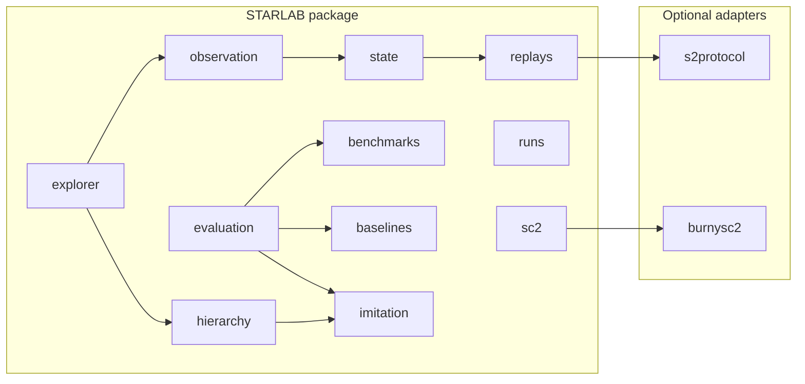

# STARLAB — Architecture Overview

**Authority:** This document orients engineers and reviewers. The canonical public ledger is `docs/starlab.md`; runtime contracts live under `docs/runtime/`.

## System diagram

## Package table

| Package | Role |
| ------- | ---- |
| `starlab.sc2` | SC2 runtime probe, match harness, environment drift (fixtures in CI; optional live adapters). |
| `starlab.runs` | Run identity, lineage seed, replay binding, canonical run artifact packaging. |
| `starlab.replays` | Replay intake, parsing (`s2protocol` isolated), metadata/timeline/features, bundles/slices. |
| `starlab.state` | Canonical state schema + pipeline from M14 bundles. |
| `starlab.observation` | Observation contract, perceptual bridge, reconciliation audit. |
| `starlab.benchmarks` | Benchmark contract + scorecard JSON Schemas. |
| `starlab.baselines` | Scripted/heuristic baseline suites. |
| `starlab.evaluation` | Tournament harness, diagnostics, evidence packs, learned-agent evaluation. |
| `starlab.imitation` | Training dataset contract, imitation baseline, predictors. |
| `starlab.hierarchy` | Hierarchical interface schema, learned hierarchical imitation agent. |
| `starlab.explorer` | Replay explorer / operator evidence surface (M31). |

## Untrusted boundaries

Treat as **untrusted** for semantic guarantees: SC2 client, Battle.net assets, Blizzard replay parsers, and third-party adapters. STARLAB-owned claims attach to **STARLAB JSON artifacts**, schemas, lineage, and CI — see `docs/starlab.md` §10.

## Source-of-truth documents

1. `docs/starlab.md` — milestone status, non-claims, authority table.  
2. `docs/starlab-vision.md` — moonshot thesis.  
3. `docs/bicetb.md` — diligence / licensing posture.  
4. `docs/runtime/*.md` — versioned runtime contracts per milestone artifact.

## Milestones vs code

Milestones name **artifact contracts** (JSON + reports). Implementation lives under the packages above; each milestone closes with tests + ledger updates. Future arc (M32+): see §7 in `docs/starlab.md`.
