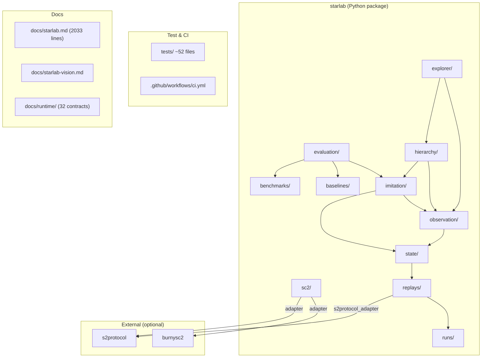

# STARLAB — Full Codebase Audit (M32)

**Auditor:** CodeAuditorGPT (staff-plus posture)
**Date:** 2026-04-10
**Repo:** https://github.com/m-cahill/starlab.git
**Commit:** `97490de27899e5f44cd61be0487725c07a71f20b`
**Languages:** Python 3.11 (sole runtime language)
**Shape:** Monorepo — single Python package (`starlab/`) + `tests/` + `docs/`

---

## 1. Executive Summary

### Strengths

1. **Exceptional governance discipline.** 32 milestones (M00–M31) merged to `main` via PRs with green CI evidence, explicit non-claims, artifact lineage, and a 2 033-line living ledger (`docs/starlab.md`). This level of traceability is rare even in production-grade projects.
2. **Strong static analysis posture.** `mypy --strict`, Ruff (E/F/I/UP/W), deterministic formatting, and `pip-audit` + CycloneDX SBOM run on every CI push — all in a single monolithic `governance` job.
3. **Clean adapter isolation.** External dependencies (`s2protocol`, `burnysc2`) are quarantined behind explicit adapter boundaries (`s2protocol_adapter.py`, `burnysc2_adapter.py`) with `mypy ignore_errors` scoping that prevents type-system leakage.

### Biggest Opportunities

1. **No test coverage measurement or gate.** ~400 test functions exist, but no coverage tool is configured (`coverage`, `pytest-cov`). There is zero visibility into which code paths are untested.
2. **Duplicated I/O helpers with inconsistent error contracts.** 12+ definitions of `load_json_object` across modules with different return types (tuple vs raise), violating DRY and making error-handling refactors expensive.
3. **Single-tier CI.** All checks (lint, type-check, test, audit, SBOM, secrets scan) run sequentially in one job. No smoke/quality/comprehensive tiering, no parallelism, no test-result artifact upload.

### Overall Score & Heatmap

| Category | Weight | Score (0–5) | Weighted |
|---|---|---|---|
| Architecture | 20% | 4.0 | 0.80 |
| Modularity / Coupling | 15% | 3.5 | 0.53 |
| Code Health | 10% | 3.5 | 0.35 |
| Tests & CI | 15% | 2.5 | 0.38 |
| Security & Supply Chain | 15% | 3.5 | 0.53 |
| Performance & Scalability | 10% | 3.0 | 0.30 |
| DX | 10% | 3.0 | 0.30 |
| Docs | 5% | 4.5 | 0.23 |
| **Overall** | **100%** | — | **3.40** |

**Heatmap legend:** 0–1 critical, 2 needs work, 3 acceptable, 4 strong, 5 exemplary.

---

## 2. Codebase Map



### Intended vs actual architecture

**Observation:** The declared architecture isolates external adapters and keeps module boundaries clean by milestone. The actual import graph (254 `from starlab.*` edges) confirms **no static import cycles**. However, there is notable cross-layer coupling: `evaluation/learned_agent_evaluation.py` imports directly from `state/canonical_state_inputs.py`, and `explorer/replay_explorer_builder.py` pulls from `hierarchy`, `imitation`, and `explorer` — making these modules hard to test or refactor independently.

**Evidence:** `starlab/evaluation/learned_agent_evaluation.py:17–25` imports `load_m14_bundle` from `starlab.state.canonical_state_inputs`.

---

## 3. Modularity & Coupling

**Score: 3.5 / 5**

### Top 3 tight couplings

#### 1. Duplicated `load_json_object` (12+ definitions)

**Observation:** The same "read UTF-8 JSON file → dict" function is defined in 12+ modules with two incompatible contracts:
- **Tuple return** (`tuple[dict | None, str | None]`): `state/canonical_state_io.py:29`, `observation/observation_surface_io.py:29`, `replays/replay_bundle_io.py:17`, `replays/metadata_io.py:38`, `replays/timeline_io.py:32`, `replays/combat_scouting_visibility_io.py:38`, `replays/build_order_economy_io.py:37`, `replays/replay_slice_io.py:17`, `observation/observation_reconciliation_inputs.py:10`, `state/canonical_state_inputs.py:22`
- **Raise on error**: `imitation/dataset_views.py:23`, `evaluation/evidence_pack_views.py:28`

**Impact:** Any change to validation logic requires 12+ edits. Callers cannot rely on a single error contract.

**Recommendation:** Extract a shared `starlab._io.load_json_object` with a single contract (prefer the tuple-return style for boundary code). Import it everywhere. ~30-minute PR.

#### 2. evaluation → state coupling

**Observation:** `learned_agent_evaluation.py` imports `load_m14_bundle` from `starlab.state.canonical_state_inputs`.

**Impact:** State module changes ripple into evaluation without a stable interface.

**Recommendation:** Define a `BundleLoader` protocol or pass a loader callable at the call site. ~30-minute PR.

#### 3. explorer → hierarchy + imitation + observation

**Observation:** `replay_explorer_builder.py` aggregates imports from `hierarchy`, `imitation`, `observation`, and `state` — it is the highest fan-in module outside `tests/`.

**Impact:** Medium — expected for Phase V integration, but makes the explorer module fragile to changes in any upstream layer.

**Recommendation:** Accept for now; if the explorer grows beyond M32, introduce a facade/aggregation service.

---

## 4. Code Quality & Health

**Score: 3.5 / 5**

### Anti-patterns found

#### Before/After: Broad `except Exception` at boundaries

**Observation (fact):** `s2protocol_adapter.py` uses `except Exception` with `# noqa: BLE001` at 8 locations (lines 65, 74, 89, 111, 121, 140, 152, 165). Same pattern in `metadata_io.py:338` and `harness.py:35`.

**Interpretation:** Appropriate at untrusted adapter boundaries (SC2 parser, match harness). However, internal extraction boundaries like `build_metadata_envelope` in `metadata_io.py` should prefer narrower exceptions to avoid masking internal bugs.

**Recommendation:** For internal-only callers (not external parser boundaries), narrow `except Exception` to the specific known exception types. Leave adapter boundaries as-is with the `BLE001` annotation.

```python
# BEFORE (metadata_io.py:332–341)
try:
    meta_env, ambiguous = build_metadata_envelope(...)
except Exception as exc:  # noqa: BLE001
    reason_codes.append("metadata_build_failed")

# AFTER
try:
    meta_env, ambiguous = build_metadata_envelope(...)
except (ValueError, KeyError, TypeError) as exc:
    reason_codes.append("metadata_build_failed")
```

#### Large files (>300 lines)

**Observation:** 17 source modules exceed 300 lines. Largest: `replays/parser_io.py` (686), `replays/replay_slice_generation.py` (680), `observation/observation_reconciliation_pipeline.py` (600).

**Interpretation:** These files mix I/O, orchestration, and domain logic. Testing and reviewing become harder at scale.

**Recommendation:** Where functions exceed ~50 lines or files exceed ~400 lines, extract cohesive helpers into private sub-modules. Prioritize `parser_io.py` and `replay_slice_generation.py`.

#### Monolithic governance test file

**Observation:** `tests/test_governance.py` is **1 189 lines** with ~100 test functions.

**Recommendation:** Split into `test_governance_docs.py`, `test_governance_milestones.py`, `test_governance_ci.py`, etc. (~30-minute effort).

#### `type: ignore` usage

**Observation:** `parser_io.py:97` uses `# type: ignore[arg-type]` to work around enum narrowing. Hides potential typing bugs.

**Recommendation:** Fix the model/type so `overrides` values are properly typed as `tuple[CheckStatus, CheckSeverity, str]`.

---

## 5. Docs & Knowledge

**Score: 4.5 / 5**

### Onboarding path

1. `README.md` → project identity, quickstart, doc map
2. `docs/starlab-vision.md` → moonshot charter
3. `docs/starlab.md` → canonical ledger (2 033 lines, comprehensive)
4. `CONTRIBUTING.md` → dev setup, tooling, branch discipline
5. `docs/runtime/*.md` → 32 runtime contract documents (one per milestone artifact)
6. `SECURITY.md` → disclosure policy

**Interpretation:** The documentation surface is **exemplary** for a research substrate. The ledger is exhaustive. The runtime contracts provide clear artifact-level governance.

### Single biggest doc gap

**Observation:** There is **no architecture overview diagram or getting-started tutorial** in the public docs beyond the milestone table. A new contributor must read ~2 000 lines of ledger to understand module relationships.

**Recommendation:** Add a `docs/architecture.md` (~1 page) with the Mermaid diagram from §2, a brief module-purpose table, and the phase/milestone progression. ~30-minute PR.

---

## 6. Tests & CI/CD Hygiene

**Score: 2.5 / 5**

### Coverage

**Observation:** No coverage tool is configured. No `pytest-cov`, no `.coveragerc`, no coverage target, no coverage artifact in CI.

**Interpretation:** This is the single largest testing gap. With ~400 tests over ~25k lines of Python, estimated coverage is likely moderate but unverified.

**Recommendation:** Add `pytest-cov` to dev dependencies, configure `[tool.coverage.run]` in `pyproject.toml`, set an initial baseline threshold (e.g., 60% statements — verify first, then ratchet), and upload coverage as a CI artifact.

### Test pyramid

| Layer | Count | Evidence |
|---|---|---|
| Unit (pure logic, golden JSON) | ~250 | `test_run_identity.py`, `test_parser_normalization.py`, schema validation tests |
| Integration (CLI via subprocess, fixture chains) | ~100 | `test_*_cli.py` files, e2e chain tests (M14→M26→M27) |
| Governance (repo wiring, doc existence) | ~100 | `test_governance.py` |
| Smoke / slow / integration markers | 0 | No custom markers; no `conftest.py` |

**Interpretation:** Good breadth but no tiering. All ~400 tests run in a single `pytest -q` invocation with no separation into fast smoke vs slow integration.

### CI/CD assessment (3-tier architecture)

| Tier | Status | Notes |
|---|---|---|
| Tier 1 (Smoke) | Missing | No marker-based fast subset |
| Tier 2 (Quality) | Partial | Single `governance` job runs everything serially |
| Tier 3 (Nightly/Comprehensive) | Missing | No scheduled or nightly runs |

### CI pipeline analysis

**Observation (ci.yml):**
- Single job `governance` on `ubuntu-latest`
- Steps run **sequentially**: checkout → Python setup → install → Ruff → Ruff format → Mypy → Pytest → pip-audit → CycloneDX → upload SBOM → Gitleaks → summary
- **No test report upload** (JUnit XML or similar)
- **No coverage artifact**
- Actions pinned to **version tags** (`@v4`, `@v5`, `@v2`), **not** commit SHAs
- Concurrency: cancel-in-progress per workflow+ref (good)
- Single Python version (3.11), single OS (ubuntu-latest)

**Recommendations:**
1. **Split CI into parallel jobs:** lint/format (Ruff), type-check (Mypy), test (Pytest), security (pip-audit + Gitleaks + SBOM). Cuts wall-clock time by ~50%.
2. **Add coverage:** `pytest --cov=starlab --cov-report=xml` + upload artifact.
3. **Add pytest markers:** `@pytest.mark.smoke` for a fast ~30-second subset. Wire as a required check.
4. **Pin actions to SHA:** e.g., `actions/checkout@<sha>` for reproducibility and supply-chain safety.
5. **Upload test results:** JUnit XML via `pytest --junitxml=results.xml` + `upload-artifact`.

### Flakiness

**Observation:** No `pytest.mark.flaky`, no `time.sleep`, no `random.` in tests/. No `xfail` or `skip` markers. Tests are deterministic by design (fixture-driven, no live SC2).

**Interpretation:** Excellent — zero flakiness indicators.

---

## 7. Security & Supply Chain

**Score: 3.5 / 5**

### Secret hygiene

| Check | Status | Evidence |
|---|---|---|
| `.gitignore` covers `.env*` | Yes | `.gitignore` lines for `.env`, `.env.*`, exception for `!.env.example` |
| `docs/company_secrets/` excluded from git | Yes | `.gitignore` + `.cursorrules` warning |
| Gitleaks in CI | Yes | `gitleaks/gitleaks-action@v2` |
| No hardcoded secrets in source | No findings | Grep for `password`, `secret`, `token`, `api_key` in `starlab/` — none found |

### Dependency risk / pinning

| Dependency | Version constraint | Risk |
|---|---|---|
| `jsonschema` | `>=4.20,<5` | Low — range-pinned, active project |
| `burnysc2` (optional) | `>=7.2,<8` | Low — optional, not in CI |
| `s2protocol` (optional) | `>=5,<6` | Low — optional, not in CI default |
| `ruff` (dev) | `>=0.4` | Medium — no upper bound; could break on major API change |
| `mypy` (dev) | `>=1.8` | Medium — no upper bound |
| `pytest` (dev) | `>=8.0` | Low |
| `pip-audit` (dev) | `>=2.7` | Low |
| `cyclonedx-bom` (dev) | `>=4.0` | Low |
| `types-jsonschema` (dev) | `>=4.20,<5` | Low |

**Recommendation:** Add upper bounds to dev dependencies (`ruff>=0.4,<1`, `mypy>=1.8,<2`) to prevent unexpected breakage. Low-effort change.

### SBOM status

**Observation:** CycloneDX SBOM generated on every CI run and uploaded as `sbom-cyclonedx-json` artifact. Excellent.

### CI trust boundaries

**Observation:** Only `secrets.GITHUB_TOKEN` is used (for Gitleaks). No third-party secrets. `contents: read` permission is explicitly scoped.

**Recommendation:** Pin the Gitleaks action to a SHA instead of `@v2` for immutable CI action references.

---

## 8. Performance & Scalability

**Score: 3.0 / 5**

### Hot paths

1. **Full-file JSON loading:** Widespread `path.read_text` + `json.loads` pattern (e.g., `learned_agent_evaluation.py:398–400`). Loads entire files into memory. Acceptable for current artifact sizes (KBs to low MBs), but would stress memory for very large replay corpora.

2. **Per-bundle I/O loops:** `load_m14_bundle` is called in loops during dataset/evaluation pipelines — O(bundles × files) with no caching or streaming. Acceptable for small corpora; would need streaming for production-scale workloads.

3. **No `lru_cache` / memoization:** Repeated canonical JSON hashing and schema validation are not cached. Acceptable for CLI batch jobs; would matter for interactive/server usage.

4. **Nested loops in extraction:** `combat_scouting_visibility_extraction.py:242–287` uses nested loops over deaths and raw lookups. CPU cost grows linearly with timeline length. Expected for the algorithm.

### Concrete profiling plan

1. **Baseline:** Run `pytest -q` with `--durations=20` to identify slowest tests as proxy for hot code.
2. **Profile pipeline:** Use `cProfile` on a full `emit_replay_explorer_surface` invocation with a multi-bundle corpus to find I/O vs compute bottlenecks.
3. **Memory:** Use `tracemalloc` on `load_m14_bundle` loops with >10 bundles to measure peak RSS.
4. **Target SLO:** For CLI batch processing — P95 < 30 seconds per bundle for the full M16→M18→M31 pipeline on the reference RTX 5090 workstation.

---

## 9. Developer Experience (DX)

**Score: 3.0 / 5**

### 15-minute new-dev journey

| Step | Time | Blockers |
|---|---|---|
| Clone repo | 1 min | None |
| Read README.md | 2 min | None |
| `pip install -e ".[dev]"` | 2–3 min | Python 3.11 required (not 3.12+) |
| `pytest -q` | 1–2 min | None (tests are fixture-driven) |
| Understand project structure | 5+ min | No architecture diagram; must read 2k-line ledger |
| **Total** | **~12 min** | Narrow Python version pin may surprise developers |

### 5-minute single-file change

| Step | Time | Blockers |
|---|---|---|
| Edit one module | 1 min | None |
| `ruff check starlab tests` | 5 sec | None |
| `mypy starlab tests` | 30 sec | None |
| `pytest -q` | 1–2 min | Runs all 400 tests; no way to run smoke subset |
| **Total** | **~3 min** | Full test suite is fast enough today |

### 3 immediate DX wins

1. **Add `pytest.mark.smoke` for a ~30-test fast subset.** Reduces iteration time for small changes from ~90 sec to ~10 sec.
2. **Add `docs/architecture.md` with module map.** Eliminates the need to read the full ledger for orientation.
3. **Add a `Makefile` (or `justfile`) with common commands:** `make lint`, `make test`, `make smoke`, `make audit`. Reduces cognitive load for new contributors.

---

## 10. Refactor Strategy (Two Options)

### Option A — Iterative (phased PRs, low blast radius)

**Rationale:** The codebase is healthy. Major refactoring is not needed. Focus on incremental quality improvements that compound over time.

**Goals:**
1. Establish coverage baseline and gate
2. Reduce duplicated I/O code
3. Tier the CI pipeline
4. Pin CI actions

**Migration steps:**
1. PR1: Add `pytest-cov`, measure baseline, upload artifact
2. PR2: Extract shared `load_json_object` to `starlab/_io.py`
3. PR3: Add `pytest.mark.smoke` to ~30 fast tests
4. PR4: Split CI into parallel lint/type/test/security jobs
5. PR5: Pin CI actions to SHAs

**Risks:** Low — each PR is independent and reversible.

**Rollback:** Revert any single PR without affecting others.

**Tools:** Ruff, mypy, pytest-cov, GitHub Actions.

### Option B — Strategic (structural)

**Rationale:** If STARLAB moves toward server deployment (Render backend) or multi-environment expansion (M33/M34), the current CLI-batch architecture needs a service layer.

**Goals:**
1. Introduce a service/usecase layer between CLI and domain logic
2. Replace per-module I/O helpers with a shared data-access layer
3. Add streaming JSON support for large corpora
4. Formalize the adapter pattern with a registry

**Migration steps:**
1. Define `starlab.services` package with thin wrappers around pipeline invocations
2. Consolidate I/O into `starlab.io` with pluggable backends (file, stream, future: S3)
3. Introduce `starlab.adapters.registry` for runtime adapter discovery
4. Migrate CLI entry points to call service layer

**Risks:** Medium — touches many modules. Requires careful testing.

**Rollback:** Feature-flag the service layer; keep CLI paths working during transition.

**Tools:** Ruff, mypy, pytest-cov, dependency injection pattern.

---

## 11. Future-Proofing & Risk Register

### Likelihood × Impact Matrix

| Risk | Likelihood | Impact | Priority |
|---|---|---|---|
| **R1:** Coverage gap hides regressions | High | High | Critical |
| **R2:** Python 3.11 EOL (Oct 2027) forces version migration | Medium | Medium | Medium |
| **R3:** `s2protocol` / `burnysc2` unmaintained upstream | Medium | Low | Low (adapters isolated) |
| **R4:** Ledger grows beyond maintainability (already 2k lines) | Medium | Medium | Medium |
| **R5:** CI wall-clock time grows with test suite | Medium | Low | Low (tests fast today) |
| **R6:** Dev dependency version drift breaks CI | Low | Medium | Low |
| **R7:** No Dependabot / automated dependency updates | Medium | Medium | Medium |

### ADRs to lock decisions

1. **ADR-001:** Coverage tooling and threshold policy — lock minimum coverage floor and ratchet direction.
2. **ADR-002:** CI architecture (1-tier vs 3-tier) — decide before M33 whether to split.
3. **ADR-003:** Python version upgrade path — document 3.11→3.12/3.13 migration prerequisites.
4. **ADR-004:** Ledger pruning policy — decide whether to archive pre-M20 closeout details to a separate file.

---

## 12. Phased Plan & Small Milestones (PR-sized)

### Phase 0 — Fix-First & Stabilize (0–1 day)

| ID | Milestone | Category | Acceptance Criteria | Risk | Rollback | Est | Owner |
|---|---|---|---|---|---|---|---|
| CI-001 | Add coverage measurement + artifact upload | Tests & CI | `pytest --cov` runs in CI; XML artifact uploaded; baseline % recorded | Low | Remove `--cov` flag | 30 min | Dev |
| CI-002 | Pin CI actions to commit SHAs | Security | All `uses:` in ci.yml reference immutable SHAs | Low | Revert to version tags | 20 min | Dev |
| CI-003 | Upload JUnit XML test results as artifact | Tests & CI | `--junitxml=results.xml` + `upload-artifact` step; artifact visible in PR | Low | Remove step | 15 min | Dev |

### Phase 1 — Document & Guardrail (1–3 days)

| ID | Milestone | Category | Acceptance Criteria | Risk | Rollback | Est | Owner |
|---|---|---|---|---|---|---|---|
| DOC-001 | Create `docs/architecture.md` with module map | Docs | Mermaid diagram + module table + phase overview exists | Low | Delete file | 30 min | Dev |
| CI-004 | Add `pytest.mark.smoke` to 25–30 fast tests | Tests & CI | `pytest -m smoke` runs in <15 sec; marker registered in `pyproject.toml` | Low | Remove markers | 45 min | Dev |
| CI-005 | Split CI into parallel jobs (lint, type, test, security) | Tests & CI | 4 parallel jobs; each passes independently; total wall-clock < 3 min | Medium | Revert to single job | 45 min | Dev |
| DX-001 | Add `Makefile` with `lint`, `test`, `smoke`, `coverage` targets | DX | `make smoke` works; `make lint` works | Low | Delete file | 20 min | Dev |
| DEP-001 | Add upper bounds to dev dependencies | Security | `ruff>=0.4,<1`, `mypy>=1.8,<2` in `pyproject.toml` | Low | Remove upper bounds | 10 min | Dev |

### Phase 2 — Harden & Enforce (3–7 days)

| ID | Milestone | Category | Acceptance Criteria | Risk | Rollback | Est | Owner |
|---|---|---|---|---|---|---|---|
| CI-006 | Set coverage threshold at baseline - 2% | Tests & CI | `--cov-fail-under=<baseline-2>` passes; CI blocks PRs that drop coverage | Low | Remove flag | 15 min | Dev |
| CODE-001 | Extract shared `load_json_object` to `starlab/_io.py` | Modularity | All 12+ call sites import from `_io`; tests pass; mypy clean | Medium | Revert extraction | 45 min | Dev |
| CODE-002 | Split `test_governance.py` into 3–4 focused modules | Tests | Same test count; each file <400 lines | Low | Revert split | 30 min | Dev |
| CODE-003 | Narrow internal `except Exception` to specific types | Code Health | Non-adapter `except Exception` replaced; BLE001 noqa retained only at adapter boundaries | Low | Revert narrows | 30 min | Dev |
| SEC-001 | Add Dependabot configuration for pip ecosystem | Security | `.github/dependabot.yml` exists; monthly schedule | Low | Delete file | 10 min | Dev |

### Phase 3 — Improve & Scale (weekly cadence)

| ID | Milestone | Category | Acceptance Criteria | Risk | Rollback | Est | Owner |
|---|---|---|---|---|---|---|---|
| CI-007 | Add nightly/weekly comprehensive CI run | Tests & CI | `schedule:` trigger runs full suite + coverage; alerts on regression | Low | Remove schedule trigger | 30 min | Dev |
| PERF-001 | Add `--durations=20` to CI pytest; record timing baseline | Performance | Timing data visible in CI logs; baseline documented | Low | Remove flag | 10 min | Dev |
| CODE-004 | Reduce largest modules to <500 lines | Code Health | `parser_io.py`, `replay_slice_generation.py`, `observation_reconciliation_pipeline.py` each <500 lines | Medium | Revert extraction | 60 min | Dev |
| DOC-002 | Archive pre-M15 closeout details to `docs/starlab_archive.md` | Docs | Ledger drops below 1500 lines; archive preserves full history | Low | Revert move | 30 min | Dev |
| CI-008 | Add Python 3.12 to CI matrix (non-blocking) | DX | `allow-failure` job for 3.12; tracks compat issues early | Low | Remove matrix entry | 30 min | Dev |

---

## 13. Machine-Readable Appendix (JSON)

```json
{
  "issues": [
    {
      "id": "ARC-001",
      "title": "No test coverage measurement or gate",
      "category": "tests_ci",
      "path": "pyproject.toml:64-66",
      "severity": "high",
      "priority": "high",
      "effort": "low",
      "impact": 5,
      "confidence": 1.0,
      "ice": 5.0,
      "evidence": "[tool.pytest.ini_options] has testpaths and python_files but no coverage config; no pytest-cov in dev deps",
      "fix_hint": "Add pytest-cov to [project.optional-dependencies] dev; add [tool.coverage.run] source = ['starlab']; wire --cov in CI"
    },
    {
      "id": "ARC-002",
      "title": "Duplicated load_json_object with inconsistent contracts",
      "category": "modularity",
      "path": "starlab/state/canonical_state_io.py:29-36",
      "severity": "medium",
      "priority": "high",
      "effort": "medium",
      "impact": 4,
      "confidence": 1.0,
      "ice": 4.0,
      "evidence": "12+ definitions of load_json_object across modules; two incompatible return contracts (tuple vs raise)",
      "fix_hint": "Extract starlab/_io.py with single load_json_object; update all imports"
    },
    {
      "id": "ARC-003",
      "title": "Single-tier CI (no parallelism, no smoke gate)",
      "category": "tests_ci",
      "path": ".github/workflows/ci.yml:13-80",
      "severity": "medium",
      "priority": "medium",
      "effort": "medium",
      "impact": 3,
      "confidence": 0.9,
      "ice": 2.7,
      "evidence": "Single job 'governance' runs all steps sequentially: Ruff, Mypy, Pytest, pip-audit, SBOM, Gitleaks",
      "fix_hint": "Split into 4 parallel jobs: lint, typecheck, test, security; add pytest.mark.smoke"
    },
    {
      "id": "ARC-004",
      "title": "CI actions pinned to version tags, not SHAs",
      "category": "security",
      "path": ".github/workflows/ci.yml:21-62",
      "severity": "medium",
      "priority": "medium",
      "effort": "low",
      "impact": 3,
      "confidence": 1.0,
      "ice": 3.0,
      "evidence": "actions/checkout@v4, actions/setup-python@v5, gitleaks/gitleaks-action@v2 — mutable tags",
      "fix_hint": "Pin each action to the full commit SHA for that version tag"
    },
    {
      "id": "ARC-005",
      "title": "evaluation → state cross-layer coupling",
      "category": "modularity",
      "path": "starlab/evaluation/learned_agent_evaluation.py:17-25",
      "severity": "low",
      "priority": "low",
      "effort": "medium",
      "impact": 2,
      "confidence": 0.8,
      "ice": 1.6,
      "evidence": "from starlab.state.canonical_state_inputs import load_m14_bundle",
      "fix_hint": "Define a BundleLoader protocol or pass loader as a callable parameter"
    },
    {
      "id": "ARC-006",
      "title": "Large source modules (>300 lines)",
      "category": "code_health",
      "path": "starlab/replays/parser_io.py:1-686",
      "severity": "low",
      "priority": "low",
      "effort": "medium",
      "impact": 2,
      "confidence": 0.8,
      "ice": 1.6,
      "evidence": "17 modules exceed 300 lines; largest: parser_io.py (686), replay_slice_generation.py (680), observation_reconciliation_pipeline.py (600)",
      "fix_hint": "Extract cohesive helper functions into private sub-modules; target <500 lines"
    },
    {
      "id": "ARC-007",
      "title": "Monolithic governance test file (1189 lines)",
      "category": "tests_ci",
      "path": "tests/test_governance.py:1-1189",
      "severity": "low",
      "priority": "low",
      "effort": "low",
      "impact": 2,
      "confidence": 1.0,
      "ice": 2.0,
      "evidence": "Single test file with ~100 test functions across docs, milestones, CI, modules",
      "fix_hint": "Split by concern: test_governance_docs.py, test_governance_milestones.py, etc."
    },
    {
      "id": "ARC-008",
      "title": "No Dependabot or automated dependency update",
      "category": "security",
      "path": ".github/",
      "severity": "low",
      "priority": "medium",
      "effort": "low",
      "impact": 2,
      "confidence": 1.0,
      "ice": 2.0,
      "evidence": "No .github/dependabot.yml; dependency updates are manual only",
      "fix_hint": "Add .github/dependabot.yml with pip ecosystem, monthly schedule"
    },
    {
      "id": "ARC-009",
      "title": "Dev dependencies lack upper bounds",
      "category": "security",
      "path": "pyproject.toml:26-33",
      "severity": "low",
      "priority": "low",
      "effort": "low",
      "impact": 2,
      "confidence": 0.9,
      "ice": 1.8,
      "evidence": "ruff>=0.4, mypy>=1.8 have no upper bounds; could break on major version",
      "fix_hint": "Add upper bounds: ruff>=0.4,<1, mypy>=1.8,<2"
    },
    {
      "id": "ARC-010",
      "title": "No architecture overview document",
      "category": "docs",
      "path": "docs/",
      "severity": "low",
      "priority": "medium",
      "effort": "low",
      "impact": 3,
      "confidence": 1.0,
      "ice": 3.0,
      "evidence": "No docs/architecture.md; new devs must read 2033-line ledger for module orientation",
      "fix_hint": "Create docs/architecture.md with Mermaid diagram + module table"
    }
  ],
  "scores": {
    "architecture": 4.0,
    "modularity": 3.5,
    "code_health": 3.5,
    "tests_ci": 2.5,
    "security": 3.5,
    "performance": 3.0,
    "dx": 3.0,
    "docs": 4.5,
    "overall_weighted": 3.4
  },
  "phases": [
    {
      "name": "Phase 0 — Fix-First & Stabilize",
      "milestones": [
        {
          "id": "CI-001",
          "milestone": "Add coverage measurement + artifact upload",
          "acceptance": ["pytest --cov runs in CI", "XML coverage artifact uploaded", "baseline coverage % recorded"],
          "risk": "low",
          "rollback": "Remove --cov flag",
          "est_hours": 0.5
        },
        {
          "id": "CI-002",
          "milestone": "Pin CI actions to commit SHAs",
          "acceptance": ["All uses: in ci.yml reference immutable SHAs"],
          "risk": "low",
          "rollback": "Revert to version tags",
          "est_hours": 0.33
        },
        {
          "id": "CI-003",
          "milestone": "Upload JUnit XML test results as artifact",
          "acceptance": ["--junitxml in CI", "artifact visible in PR"],
          "risk": "low",
          "rollback": "Remove step",
          "est_hours": 0.25
        }
      ]
    },
    {
      "name": "Phase 1 — Document & Guardrail",
      "milestones": [
        {
          "id": "DOC-001",
          "milestone": "Create docs/architecture.md with module map",
          "acceptance": ["Mermaid diagram exists", "Module table exists", "Phase overview exists"],
          "risk": "low",
          "rollback": "Delete file",
          "est_hours": 0.5
        },
        {
          "id": "CI-004",
          "milestone": "Add pytest.mark.smoke to 25-30 fast tests",
          "acceptance": ["pytest -m smoke runs in <15 sec", "marker registered in pyproject.toml"],
          "risk": "low",
          "rollback": "Remove markers",
          "est_hours": 0.75
        },
        {
          "id": "CI-005",
          "milestone": "Split CI into parallel jobs",
          "acceptance": ["4 parallel jobs pass independently", "total wall-clock < 3 min"],
          "risk": "medium",
          "rollback": "Revert to single job",
          "est_hours": 0.75
        },
        {
          "id": "DX-001",
          "milestone": "Add Makefile with lint, test, smoke, coverage targets",
          "acceptance": ["make smoke works", "make lint works"],
          "risk": "low",
          "rollback": "Delete file",
          "est_hours": 0.33
        },
        {
          "id": "DEP-001",
          "milestone": "Add upper bounds to dev dependencies",
          "acceptance": ["ruff, mypy have upper bounds in pyproject.toml"],
          "risk": "low",
          "rollback": "Remove upper bounds",
          "est_hours": 0.17
        }
      ]
    },
    {
      "name": "Phase 2 — Harden & Enforce",
      "milestones": [
        {
          "id": "CI-006",
          "milestone": "Set coverage threshold at baseline minus 2%",
          "acceptance": ["--cov-fail-under passes", "CI blocks PRs that drop coverage"],
          "risk": "low",
          "rollback": "Remove flag",
          "est_hours": 0.25
        },
        {
          "id": "CODE-001",
          "milestone": "Extract shared load_json_object to starlab/_io.py",
          "acceptance": ["All 12+ call sites import from _io", "tests pass", "mypy clean"],
          "risk": "medium",
          "rollback": "Revert extraction",
          "est_hours": 0.75
        },
        {
          "id": "CODE-002",
          "milestone": "Split test_governance.py into focused modules",
          "acceptance": ["Same test count", "each file <400 lines"],
          "risk": "low",
          "rollback": "Revert split",
          "est_hours": 0.5
        },
        {
          "id": "CODE-003",
          "milestone": "Narrow internal except Exception to specific types",
          "acceptance": ["Non-adapter except Exception replaced", "BLE001 retained at adapter boundaries only"],
          "risk": "low",
          "rollback": "Revert narrows",
          "est_hours": 0.5
        },
        {
          "id": "SEC-001",
          "milestone": "Add Dependabot configuration",
          "acceptance": [".github/dependabot.yml exists", "monthly pip schedule configured"],
          "risk": "low",
          "rollback": "Delete file",
          "est_hours": 0.17
        }
      ]
    },
    {
      "name": "Phase 3 — Improve & Scale",
      "milestones": [
        {
          "id": "CI-007",
          "milestone": "Add nightly/weekly comprehensive CI run",
          "acceptance": ["schedule trigger runs full suite + coverage", "alerts on regression"],
          "risk": "low",
          "rollback": "Remove schedule trigger",
          "est_hours": 0.5
        },
        {
          "id": "PERF-001",
          "milestone": "Add --durations=20 to CI pytest; record timing baseline",
          "acceptance": ["Timing data visible in CI logs", "baseline documented"],
          "risk": "low",
          "rollback": "Remove flag",
          "est_hours": 0.17
        },
        {
          "id": "CODE-004",
          "milestone": "Reduce largest modules to <500 lines",
          "acceptance": ["parser_io.py, replay_slice_generation.py, observation_reconciliation_pipeline.py each <500 lines"],
          "risk": "medium",
          "rollback": "Revert extraction",
          "est_hours": 1.0
        },
        {
          "id": "DOC-002",
          "milestone": "Archive pre-M15 closeout details to docs/starlab_archive.md",
          "acceptance": ["Ledger drops below 1500 lines", "archive preserves full history"],
          "risk": "low",
          "rollback": "Revert move",
          "est_hours": 0.5
        },
        {
          "id": "CI-008",
          "milestone": "Add Python 3.12 to CI matrix (non-blocking)",
          "acceptance": ["allow-failure job for 3.12", "tracks compat issues early"],
          "risk": "low",
          "rollback": "Remove matrix entry",
          "est_hours": 0.5
        }
      ]
    }
  ],
  "metadata": {
    "repo": "https://github.com/m-cahill/starlab.git",
    "commit": "97490de27899e5f44cd61be0487725c07a71f20b",
    "languages": ["py"],
    "python_version": "3.11",
    "total_py_files": 197,
    "total_py_lines": 25388,
    "test_count_approx": 400,
    "milestones_completed": 32,
    "audit_date": "2026-04-10"
  }
}
```

---

## Appendix A — File Metrics Summary

| Area | Files | Lines (approx) |
|---|---|---|
| `starlab/` (source) | 147 | ~19,000 |
| `tests/` | 53 | ~6,400 |
| `docs/` (markdown) | 227+ | ~50,000+ |
| **Total Python** | **197** | **25,388** |

## Appendix B — Dependency Tree (Runtime)

```
starlab
└── jsonschema >=4.20,<5

[optional: sc2-harness]
└── burnysc2 >=7.2,<8

[optional: replay-parser]
└── s2protocol >=5,<6

[dev]
├── ruff >=0.4
├── mypy >=1.8
├── pytest >=8.0
├── pip-audit >=2.7
├── cyclonedx-bom >=4.0
└── types-jsonschema >=4.20,<5
```

## Appendix C — CI Pipeline Diagram (Current)

```
push/PR to main
└── governance (ubuntu-latest, Python 3.11)
    ├── 1. Checkout (fetch-depth: 0)
    ├── 2. Setup Python 3.11 (cache: pip)
    ├── 3. pip install -e ".[dev]"
    ├── 4. ruff check starlab tests
    ├── 5. ruff format --check starlab tests
    ├── 6. mypy starlab tests
    ├── 7. pytest -q
    ├── 8. pip-audit
    ├── 9. CycloneDX SBOM → sbom.json
    ├── 10. Upload SBOM artifact
    ├── 11. Gitleaks
    └── 12. Job summary
```

## Appendix D — Audit Evidence Index

| Finding | Evidence path | Lines |
|---|---|---|
| No coverage config | `pyproject.toml` | 64–66 |
| Duplicated `load_json_object` | `starlab/state/canonical_state_io.py` | 29–36 |
| Single-tier CI | `.github/workflows/ci.yml` | 13–80 |
| Actions not SHA-pinned | `.github/workflows/ci.yml` | 21, 26, 55, 62 |
| evaluation→state coupling | `starlab/evaluation/learned_agent_evaluation.py` | 17–25 |
| Broad `except Exception` | `starlab/replays/s2protocol_adapter.py` | 65, 74, 89, 111, 121, 140, 152, 165 |
| Largest source file | `starlab/replays/parser_io.py` | 1–686 |
| Monolithic test file | `tests/test_governance.py` | 1–1189 |
| Dev deps no upper bound | `pyproject.toml` | 26–33 |
| No architecture doc | `docs/` | — |
