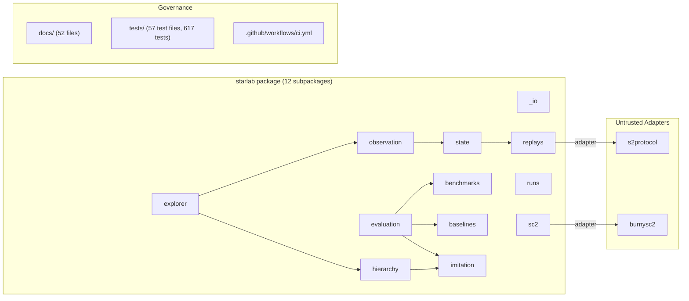

# STARLAB — M37 Full Codebase Audit

**Audit Date:** 2026-04-10  
**Commit:** `08903cfb361dd147f4a730f8294be4bcfda55bf1`  
**Repo:** https://github.com/m-cahill/starlab.git  
**Primary Language:** Python 3.11  
**Auditor Persona:** CodeAuditorGPT (staff-plus; architecture, CI/CD, reliability, security, DX)

---

## 1. Executive Summary

### Strengths

1. **Exceptional governance discipline.** 37 milestones closed (M00–M36) with full CI evidence, merge-boundary records, explicit non-claims, and a living canonical ledger (`docs/starlab.md`, 2153 lines). Every milestone has a plan, run record, summary, and audit. This level of evidence rigor is rare in any software project.
2. **Mature CI/CD architecture.** Five parallel CI tiers (`quality`, `smoke`, `tests`, `security`, `fieldtest`) feed a final `governance` aggregate gate. SHA-pinned Actions, CycloneDX SBOM, pip-audit, Gitleaks, JUnit + coverage XML artifacts, and a fixture-only field-test lane. Coverage gate at 75.4% with a 2% safety margin.
3. **Clean architectural layering.** 12 well-separated subpackages (`sc2`, `runs`, `replays`, `state`, `observation`, `benchmarks`, `baselines`, `evaluation`, `imitation`, `hierarchy`, `explorer`, `_io`) with clear dependency direction from replay-derived data toward evidence surfaces. Untrusted boundaries (SC2 client, `s2protocol`, `burnysc2`) are behind isolated adapters.

### Biggest Opportunities

1. **Documentation density is high but onboarding friction remains.** The ledger is 2153 lines; a new engineer needs 30+ minutes to orient. The README is stale (references M03 as current; M37 is current). A "quick-start" summary and README update would sharply reduce onboarding time.
2. **No branch-coverage visibility.** `branch = true` is configured in `[tool.coverage.run]`, but the fail-under gate (75.4%) is line-only. Branch coverage is not surfaced or gated separately.
3. **Test execution is fully serial.** No `pytest-xdist` or parallel test strategy. With 617 tests the suite is fast today, but as the project grows this will become a bottleneck.

### Overall Score & Heatmap

| Category | Weight | Score (0–5) | Weighted |
|---|---|---|---|
| Architecture | 20% | 4.5 | 0.90 |
| Modularity & Coupling | 15% | 4.0 | 0.60 |
| Code Health | 10% | 4.0 | 0.40 |
| Tests & CI/CD | 15% | 4.5 | 0.675 |
| Security & Supply Chain | 15% | 4.0 | 0.60 |
| Performance & Scalability | 10% | 3.0 | 0.30 |
| Developer Experience (DX) | 10% | 3.5 | 0.35 |
| Documentation | 5% | 4.0 | 0.20 |
| **Overall Weighted** | **100%** | — | **4.03** |

---

## 2. Codebase Map

### Structure



### File Inventory

| Category | Count |
|---|---|
| Tracked files (git) | 605 |
| Python source files (`.py`) | 212 |
| Markdown documentation (`.md`) | 253 |
| JSON fixtures/artifacts (`.json`) | 126 |
| SC2 replay fixtures (`.SC2Replay`) | 3 |
| CI/CD config (`.yml`/`.yaml`) | 3 |
| Source package modules (`starlab/`) | 177 `.py` files |
| Test modules (`tests/`) | 57 `test_*.py` files |
| Test fixtures (`tests/fixtures/`) | 125 files across 24 milestone dirs |

### Drift vs Intended Architecture

**Observation:** The architecture as implemented closely matches the documented architecture in `docs/architecture.md`. The Mermaid diagram, the dependency-direction rules, and the package-purpose table are accurate.

**Minor drift:** `README.md` references M03/M04 as current (stale vs M37 actual). No structural architecture drift detected.

---

## 3. Modularity & Coupling

**Score: 4.0/5**

### Top 3 Coupling Observations

1. **`starlab.evaluation` has broad reach.** `evaluation/` imports from `benchmarks`, `baselines`, `imitation`, and `state`—it is the widest fan-in subpackage. This is architecturally intentional (evaluation is an aggregation layer), but `m14_bundle_loader.py` introduced a Protocol-based seam (M35) to decouple bundle-loading concerns.
   - **Impact:** Medium. Adding new evaluation surfaces requires touching multiple packages.
   - **Recommendation:** Continue the Protocol/interface pattern from M35. Consider a thin "registry" for suite/baseline loaders.

2. **`starlab.imitation.dataset_views` re-exports `load_json_object` from `starlab._io`.** The `__all__` in `dataset_views.py` includes `load_json_object`, creating a re-export that consumers could call from either location.
   - **Impact:** Low. Confusing for discoverability but not a coupling hazard.
   - **Recommendation:** Remove the re-export from `dataset_views.__all__`; let callers import from `starlab._io` directly.

3. **`starlab.explorer.replay_explorer_builder` has a private `_load_json` helper** that duplicates `starlab._io.load_json_object` behavior.
   - **Impact:** Low. Internal duplication, not public API.
   - **Recommendation:** Replace with a call to `starlab._io.load_json_object` or `load_json_object_strict` for consistency.

### Positive Modularity Signals

- Adapter isolation for `s2protocol` and `burnysc2` behind Protocol interfaces.
- `M14BundleLoader` Protocol (M35) decouples evaluation from replay bundle internals.
- Import-boundary governance tests (`test_governance_runtime.py`) enforce that specific modules do **not** import `starlab.replays`, `starlab.sc2`, or `s2protocol`.

---

## 4. Code Quality & Health

**Score: 4.0/5**

### Linting & Formatting

- **Ruff:** `select = ["E", "F", "I", "UP", "W"]` — good baseline set covering pyflakes, isort, pyupgrade, and warnings. Line length 100.
- **Mypy:** `strict = true` globally with targeted overrides for test files (`disallow_untyped_defs = false`) and two adapter modules (`ignore_errors = true` for `burnysc2_adapter` and `s2protocol_adapter`).
- **Evidence:** CI enforces both `ruff check` and `ruff format --check` on every PR.

### Anti-Patterns Observed

1. **`except Exception` broad catches in adapter modules.**
   - **Observation:** `s2protocol_adapter.py` and `burnysc2_adapter.py` use broad `except Exception` — documented as approved untrusted-boundary catches in `docs/audit/broad_exception_boundaries.md` (DIR-005 closure).
   - **Interpretation:** Justified for untrusted upstream code. Properly documented.
   - **Recommendation:** No change needed. The documentation-only validation (M34) was the correct posture.

2. **Constants-only modules lack `__all__`.**
   - **Observation:** Many `*_models.py` and `*_catalog.py` files expose constants without `__all__`. Most `__init__.py` files are docstring-only with no re-exports.
   - **Interpretation:** This is a deliberate design choice for a research substrate (callers import specific symbols). Not a defect, but slightly complicates IDE discoverability.
   - **Recommendation:** Optional: add `__all__` to `*_models.py` files to make the public API explicit.

3. **Largest modules approach complexity thresholds.**
   - **Observation:** `replays/metadata_io.py` (587 lines), `replays/intake_policy.py` (563 lines), `replays/combat_scouting_visibility_extraction.py` (549 lines) are the largest. All are under 600 lines.
   - **Interpretation:** Manageable size. The M35 structural decoupling already split several larger modules (`parser_io` → `parser_io_run`, `parser_io_checks`, `parser_io_raw_parse`, `parser_io_receipt_report`).
   - **Recommendation:** Monitor. If any module crosses ~600 lines in M37+, apply the same decomposition pattern.

---

## 5. Docs & Knowledge

**Score: 4.0/5**

### Documentation Inventory

| Area | Files | Purpose |
|---|---|---|
| `docs/` root | 11 files | Architecture, clone-to-run, vision, ledger, operating manual, archive |
| `docs/runtime/` | 34 contracts | One per milestone's runtime contract (M02–M33) |
| `docs/audit/` | 2 files | Deferred issues registry, broad exception boundaries |
| `docs/deployment/` | 2 files | Deployment posture, env matrix |
| `docs/diligence/` | 3 files | Field-test checklist, session template, manual promotion readiness |
| `docs/milestone_summaries/` | (dir) | Milestone-specific summaries |
| `docs/company_secrets/milestones/` | M00–M39 dirs | Per-milestone plan, toolcalls, run1, summary, audit |

### Onboarding Path

1. `docs/starlab-vision.md` → moonshot thesis (324 lines; clear and well-structured)
2. `docs/starlab.md` → canonical ledger (2153 lines; comprehensive but dense)
3. `docs/getting_started_clone_to_run.md` → engineer fast-path (clear 5-step path)
4. `docs/architecture.md` → system diagram + package table (excellent)
5. `Makefile` → developer surface (`install-dev`, `smoke`, `test`, `fieldtest`)

### Single Biggest Doc Gap

**The README is stale.** `README.md` references M03/M04 as the current milestone. The actual current milestone is M37. The README's "Current Status" section, milestone table, and program shape do not reflect the 37 milestones that have closed. A README refresh is the single highest-impact documentation fix.

**Before (stale):**
> **Current Status:** M00 through M03 are merged to main. M04 is next.

**After (corrected):**
> **Current Status:** M00 through M36 are merged to main. M37 (Public Flagship Proof Pack) is the current milestone.

---

## 6. Tests & CI/CD Hygiene

**Score: 4.5/5**

### Test Coverage

- **Line coverage gate:** 75.4% (`fail_under` in `pyproject.toml`)
- **Branch coverage:** Enabled (`branch = true`) but not gated separately
- **Total tests:** 617 collected (546 `def test_*` + parametrization expansion)
- **Test files:** 57 across all milestones
- **Fixtures:** 125 files across 24 milestone directories
- **Smoke subset:** `@pytest.mark.smoke` on ~25–30 key tests

### CI Architecture (3-Tier Assessment)

| Tier | CI Job | What It Runs | Status |
|---|---|---|---|
| Tier 1 (Smoke) | `smoke` | `pytest -q -m smoke` + JUnit artifact | ✅ Fast, deterministic |
| Tier 2 (Quality + Tests) | `quality` + `tests` | Ruff + Mypy + full pytest + coverage + JUnit | ✅ Moderate threshold |
| Tier 3 (Security + Field) | `security` + `fieldtest` | pip-audit + SBOM + Gitleaks + M31 explorer | ✅ Non-blocking-friendly |
| Aggregate | `governance` | `needs: [quality, smoke, tests, security, fieldtest]` | ✅ Required merge gate |

### CI Artifacts Produced

| Artifact | Job | Always Uploaded |
|---|---|---|
| `coverage-xml` | tests | ✅ (`if-no-files-found: error`) |
| `pytest-junit-xml` | tests | ✅ |
| `pytest-smoke-junit-xml` | smoke | ✅ |
| `sbom-cyclonedx-json` | security | ✅ |
| `fieldtest-output` | fieldtest | ✅ |

### Positive Signals

- SHA-pinned Actions (checkout, setup-python, upload-artifact, gitleaks) — immutable CI supply chain
- `concurrency` with `cancel-in-progress: true` — saves CI minutes
- All 5 tier jobs run in parallel; `governance` is a lightweight fan-in
- Coverage gate at baseline - 2% margin (per audit guardrail)
- JUnit XML enables future CI reporting integration

### Gaps

- **No `pytest-xdist`:** Tests run serially. At 617 tests this is manageable (~30–60s) but won't scale.
- **No flakiness detection:** No retry or flaky-test marking beyond the single `smoke` marker.
- **No artifacts-always-upload on failure:** The `upload-artifact` steps only run on success (default `if: success()`). Adding `if: always()` would preserve evidence on failures.

---

## 7. Security & Supply Chain

**Score: 4.0/5**

### Secret Hygiene

- **Gitleaks** runs in CI on every PR/push — active secret scanning.
- `.gitignore` excludes `.env`, `.env.*`, credentials, and `docs/company_secrets/` subtrees (except tracked `milestones/`).
- No hardcoded secrets observed in source code.

### Dependency Risk & Pinning

- **Runtime deps:** Only `jsonschema>=4.20,<5` — minimal attack surface.
- **Optional deps:** `burnysc2>=7.2,<8` and `s2protocol>=5,<6` — not installed in CI by default (fixture-driven).
- **Dev deps:** `ruff>=0.4,<1`, `mypy>=1.8,<2`, `pytest>=8.0,<9`, `pytest-cov>=5.0,<6`, `pip-audit>=2.7,<3`, `cyclonedx-bom>=4.0,<5`, `types-jsonschema>=4.20,<5` — all capped with upper bounds (M34/DIR-006).
- **Dependabot:** Configured for weekly `pip` + `github-actions` updates on `main`.
- **pip-audit:** Runs in CI security job.
- **CycloneDX SBOM:** Generated and uploaded as artifact in CI.

### SBOM Status

CycloneDX SBOM is generated on every CI run and uploaded as `sbom-cyclonedx-json`. This is a strong supply-chain posture.

### CI Trust Boundaries

- Actions are SHA-pinned (not tag-pinned) — good.
- `permissions: contents: read` on all jobs — least-privilege.
- `GITHUB_TOKEN` only used by Gitleaks (required for that action).
- No write permissions granted to any CI job.

### Gap

- **No `--require-hashes` in pip install.** `pip install -e ".[dev]"` does not enforce hash-checking. For a source-available research project this is low-risk, but for production-grade supply-chain hardening, hash pinning via a lockfile would be stronger.

---

## 8. Performance & Scalability

**Score: 3.0/5**

### Current State

This is an **offline, fixture-driven research substrate** — not a web service. Performance in the traditional sense (latency, throughput, P95) is not the primary concern. The relevant performance dimensions are:

1. **CI execution time:** Currently manageable. Five parallel jobs complete in under 5 minutes total (estimated from GitHub Actions runner times).
2. **Test suite speed:** 617 tests run serially. No profiling data available, but fixture-driven JSON tests are typically fast.
3. **Replay processing:** All extraction pipelines (M08–M14) are single-threaded, single-file. For production corpus processing at scale, this would need parallelization.

### Hot Paths

- `replay_slice_generation_envelope.py` (521 lines) — generates slices from timeline + combat + economy planes. Sequential iteration over all events.
- `combat_scouting_visibility_extraction.py` (549 lines) — extracts visibility windows. O(events × players) in the inner loop.
- `canonical_state_derivation.py` (466 lines) — derives state from M14 bundles. Single-pass aggregation.

### Concrete Profiling Plan

1. **Instrument `make fieldtest`** with `cProfile` to establish a local baseline.
2. **Add `pytest-benchmark`** for the top-5 largest extraction modules (M10–M14).
3. **Measure CI wall time** per job across the last 10 runs (available from GitHub Actions API).
4. **Set explicit targets:** CI P95 < 5 min total; local `make test` < 120s; `make fieldtest` < 30s.

---

## 9. Developer Experience (DX)

**Score: 3.5/5**

### 15-Minute New-Dev Journey

| Step | Time (est.) | Blocker? |
|---|---|---|
| Clone repo | 30s | No |
| Read README | 3 min | **Stale** — references M03, not M37 |
| Install dev deps (`pip install -e ".[dev]"`) | 2 min | No (Python 3.11 required) |
| Run `make smoke` | 30s | No |
| Run `make test` | 1–2 min | No |
| Run `make fieldtest` | 30s | No |
| Read `docs/getting_started_clone_to_run.md` | 2 min | No |
| Read `docs/architecture.md` | 3 min | No |
| Orient in `docs/starlab.md` | 5+ min | **Dense** — 2153 lines |
| **Total** | **~15 min** | Achievable but tight |

### 5-Minute Single-File Change

| Step | Time (est.) | Notes |
|---|---|---|
| Edit a module in `starlab/` | 30s | |
| Run `ruff check starlab/` | 5s | |
| Run `ruff format starlab/` | 5s | |
| Run `mypy starlab/` | 15s | |
| Run `pytest -q` | 60s | |
| **Total** | **~2 min** | Well under 5 min |

### 3 Immediate DX Wins

1. **Update README.md** — bring current milestone, test count, and program state up to date. (Est: 30 min)
2. **Add a `make check` target** that runs `lint + typecheck + test` in sequence — single command for pre-push validation. (Est: 10 min)
3. **Add `conftest.py` with shared fixtures** — several test files re-create similar JSON fixtures inline. A shared `conftest.py` with common fixture-loading helpers would reduce boilerplate. (Est: 45 min)

---

## 10. Refactor Strategy (Two Options)

### Option A: Iterative (Phased PRs, Low Blast Radius)

**Rationale:** The codebase is healthy. No urgent structural issues. Incremental improvements as part of M37 flagship work.

**Goals:**
- Update README to reflect M37 state
- Add `make check` convenience target
- Add `if: always()` to CI artifact uploads
- Surface branch-coverage numbers (no new gate yet)

**Migration Steps:**
1. PR 1: README refresh + `Makefile` `check` target
2. PR 2: CI `if: always()` on artifact uploads
3. PR 3: Branch-coverage reporting (add `--cov-branch` output to CI summary)

**Risks:** Minimal. All changes are additive and non-breaking.
**Rollback:** Revert individual PRs.

### Option B: Strategic (Structural)

**Rationale:** Prepare the substrate for M38–M39 multi-environment expansion.

**Goals:**
- Extract a `starlab.core` package for environment-agnostic interfaces (Protocols, JSON schemas, artifact contracts)
- Move SC2-specific code into `starlab.environments.sc2`
- Define a `starlab.environments` namespace for future game environments
- Harden the `M14BundleLoader` Protocol into a general `EnvironmentBundleLoader`

**Migration Steps:**
1. Define `starlab.core` with Protocol interfaces
2. Move shared schema/contract code out of `starlab.state` and `starlab.observation`
3. Rename `starlab.sc2` → `starlab.environments.sc2`
4. Update all imports (automated via Ruff `--fix` or `rope`)
5. Governance test updates

**Risks:** Medium. Import path changes touch many files. Requires coordination with milestone governance.
**Rollback:** `git revert` the namespace-restructuring PR.
**Tools:** `ruff --fix` for import sorting; `rope` or IDE refactoring for renames; `pytest` full suite as regression gate.

---

## 11. Future-Proofing & Risk Register

### Likelihood × Impact Matrix

| Risk | Likelihood | Impact | Mitigation |
|---|---|---|---|
| README staleness erodes first impressions | High | Medium | Update README in M37 |
| `s2protocol` deprecation breaks replay parsing | Medium | High | Adapter isolation + `ignore_errors` in Mypy; monitor upstream |
| Coverage regression below 75.4% | Low | Medium | Gate + 2% margin + Dependabot |
| CI minutes growth as test count increases | Medium | Medium | Add `pytest-xdist` before 1000 tests |
| Multi-environment expansion creates import churn | Low | High | ADR before M38; Option B refactor |
| Python 3.11 EOL (Oct 2027) | Low | Low | `requires-python` already pinned; plan upgrade in M38 timeframe |

### ADRs to Lock Decisions

1. **ADR-001: Multi-environment namespace structure** — decide `starlab.environments.*` vs flat before M38.
2. **ADR-002: Operating manual v1 promotion scope** — define what the canonical manual covers vs ledger.
3. **ADR-003: Branch-coverage gating policy** — decide whether to add a separate branch-coverage threshold.

---

## 12. Phased Plan & Small Milestones (PR-Sized)

### Phase 0 — Fix-First & Stabilize (0–1 day)

| ID | Milestone | Category | Acceptance Criteria | Risk | Rollback | Est | Owner |
|---|---|---|---|---|---|---|---|
| FIX-001 | Update README.md to reflect M37 state | docs | README references M37 as current; milestone table shows M00–M36 complete | Low | Revert commit | 30 min | Dev |
| FIX-002 | Add `if: always()` to CI artifact upload steps | ci | Coverage/JUnit/SBOM artifacts uploaded even on test failure | Low | Revert CI change | 15 min | Dev |
| FIX-003 | Add `make check` convenience target | dx | `make check` runs lint + typecheck + test in sequence | Low | Remove target | 10 min | Dev |

### Phase 1 — Document & Guardrail (1–3 days)

| ID | Milestone | Category | Acceptance Criteria | Risk | Rollback | Est | Owner |
|---|---|---|---|---|---|---|---|
| DOC-001 | Surface branch-coverage numbers in CI output | ci | Branch-coverage percentage appears in `tests` job summary | Low | Remove reporting step | 30 min | Dev |
| DOC-002 | Add `conftest.py` with shared fixture helpers | tests | At least 3 test files refactored to use shared fixtures; test count unchanged | Low | Revert conftest + restore inline fixtures | 45 min | Dev |
| DOC-003 | Archive M35 full audit artifacts formally | docs | `M35_fullaudit.md` and `M35_fullaudit.json` referenced in ledger archive | Low | Revert ledger entry | 15 min | Dev |

### Phase 2 — Harden & Enforce (3–7 days)

| ID | Milestone | Category | Acceptance Criteria | Risk | Rollback | Est | Owner |
|---|---|---|---|---|---|---|---|
| HARD-001 | Remove `load_json_object` re-export from `dataset_views.__all__` | modularity | Callers import from `starlab._io`; no test failures | Low | Restore re-export | 20 min | Dev |
| HARD-002 | Replace `_load_json` in `replay_explorer_builder` with `starlab._io` | modularity | Explorer uses shared I/O; tests pass | Low | Restore local helper | 15 min | Dev |
| HARD-003 | Add `pytest-xdist` for parallel test execution | ci | `pytest -n auto` works locally; CI updated | Medium | Remove `-n auto` flag | 45 min | Dev |

### Phase 3 — Improve & Scale (weekly cadence)

| ID | Milestone | Category | Acceptance Criteria | Risk | Rollback | Est | Owner |
|---|---|---|---|---|---|---|---|
| SCALE-001 | Add `pytest-benchmark` for top-5 extraction modules | perf | Baseline benchmarks recorded in `.benchmarks/` | Low | Remove benchmark tests | 60 min | Dev |
| SCALE-002 | Draft ADR-001 for multi-environment namespace | architecture | ADR committed under `docs/`; reviewed | Low | Remove ADR | 45 min | Dev |
| SCALE-003 | Plan Python 3.12/3.13 upgrade path | maintenance | `requires-python` widened or upgrade plan documented | Medium | Narrow back | 30 min | Dev |

---

## 13. Machine-Readable Appendix (JSON)

```json
{
  "issues": [
    {
      "id": "DOC-001",
      "title": "README.md is stale (references M03/M04 as current)",
      "category": "docs",
      "path": "README.md:1-219",
      "severity": "medium",
      "priority": "high",
      "effort": "low",
      "impact": 4,
      "confidence": 1.0,
      "ice": 4.0,
      "evidence": "README says 'M00 through M03 are merged to main. M04 is next.' — actual current milestone is M37.",
      "fix_hint": "Update README Current Status, milestone table, and program shape to reflect M37."
    },
    {
      "id": "MOD-001",
      "title": "load_json_object re-exported from dataset_views.__all__",
      "category": "modularity",
      "path": "starlab/imitation/dataset_views.py",
      "severity": "low",
      "priority": "low",
      "effort": "low",
      "impact": 2,
      "confidence": 0.9,
      "ice": 1.8,
      "evidence": "__all__ includes 'load_json_object' which is defined in starlab._io",
      "fix_hint": "Remove load_json_object from dataset_views.__all__; update callers to import from starlab._io."
    },
    {
      "id": "MOD-002",
      "title": "Duplicate _load_json helper in replay_explorer_builder",
      "category": "modularity",
      "path": "starlab/explorer/replay_explorer_builder.py",
      "severity": "low",
      "priority": "low",
      "effort": "low",
      "impact": 2,
      "confidence": 0.8,
      "ice": 1.6,
      "evidence": "Private _load_json duplicates starlab._io.load_json_object behavior",
      "fix_hint": "Replace _load_json with starlab._io.load_json_object or load_json_object_strict."
    },
    {
      "id": "CI-001",
      "title": "CI artifact uploads lack if: always()",
      "category": "tests_ci",
      "path": ".github/workflows/ci.yml",
      "severity": "medium",
      "priority": "medium",
      "effort": "low",
      "impact": 3,
      "confidence": 1.0,
      "ice": 3.0,
      "evidence": "upload-artifact steps use default if: success(); artifacts lost on failure",
      "fix_hint": "Add 'if: always()' to coverage/JUnit/SBOM upload steps."
    },
    {
      "id": "CI-002",
      "title": "No parallel test execution (pytest-xdist)",
      "category": "tests_ci",
      "path": "pyproject.toml",
      "severity": "low",
      "priority": "low",
      "effort": "medium",
      "impact": 3,
      "confidence": 0.7,
      "ice": 2.1,
      "evidence": "617 tests run serially; no pytest-xdist in dev dependencies",
      "fix_hint": "Add pytest-xdist to dev deps; use pytest -n auto in CI tests job."
    },
    {
      "id": "COV-001",
      "title": "Branch coverage not gated separately",
      "category": "tests_ci",
      "path": "pyproject.toml:75-82",
      "severity": "low",
      "priority": "low",
      "effort": "low",
      "impact": 2,
      "confidence": 0.8,
      "ice": 1.6,
      "evidence": "branch = true is set but fail_under (75.4) applies to combined line+branch",
      "fix_hint": "Surface branch-coverage percentage in CI; consider separate branch threshold later."
    },
    {
      "id": "DX-001",
      "title": "No 'make check' convenience target",
      "category": "dx",
      "path": "Makefile",
      "severity": "low",
      "priority": "medium",
      "effort": "low",
      "impact": 3,
      "confidence": 1.0,
      "ice": 3.0,
      "evidence": "Makefile has lint, typecheck, test as separate targets but no combined pre-push check",
      "fix_hint": "Add 'check: lint typecheck test' target to Makefile."
    },
    {
      "id": "DX-002",
      "title": "No shared conftest.py for test fixtures",
      "category": "dx",
      "path": "tests/",
      "severity": "low",
      "priority": "low",
      "effort": "medium",
      "impact": 2,
      "confidence": 0.7,
      "ice": 1.4,
      "evidence": "No conftest.py found; fixture loading patterns repeated across test files",
      "fix_hint": "Create tests/conftest.py with shared fixture-loading helpers."
    }
  ],
  "scores": {
    "architecture": 4.5,
    "modularity": 4.0,
    "code_health": 4.0,
    "tests_ci": 4.5,
    "security": 4.0,
    "performance": 3.0,
    "dx": 3.5,
    "docs": 4.0,
    "overall_weighted": 4.03
  },
  "phases": [
    {
      "name": "Phase 0 — Fix-First & Stabilize",
      "milestones": [
        {
          "id": "FIX-001",
          "milestone": "Update README.md to reflect M37 state",
          "acceptance": ["README references M37 as current", "Milestone table shows M00-M36 complete"],
          "risk": "low",
          "rollback": "revert commit",
          "est_hours": 0.5
        },
        {
          "id": "FIX-002",
          "milestone": "Add if: always() to CI artifact upload steps",
          "acceptance": ["Artifacts uploaded on test failure", "CI workflow passes"],
          "risk": "low",
          "rollback": "revert CI change",
          "est_hours": 0.25
        },
        {
          "id": "FIX-003",
          "milestone": "Add make check convenience target",
          "acceptance": ["make check runs lint + typecheck + test", "Documented in README"],
          "risk": "low",
          "rollback": "remove target",
          "est_hours": 0.15
        }
      ]
    },
    {
      "name": "Phase 1 — Document & Guardrail",
      "milestones": [
        {
          "id": "DOC-001",
          "milestone": "Surface branch-coverage numbers in CI output",
          "acceptance": ["Branch-coverage percentage in tests job summary"],
          "risk": "low",
          "rollback": "remove reporting step",
          "est_hours": 0.5
        },
        {
          "id": "DOC-002",
          "milestone": "Add conftest.py with shared fixture helpers",
          "acceptance": ["At least 3 test files use shared fixtures", "Test count unchanged"],
          "risk": "low",
          "rollback": "revert conftest",
          "est_hours": 0.75
        },
        {
          "id": "DOC-003",
          "milestone": "Archive M35 full audit artifacts formally",
          "acceptance": ["Artifacts referenced in ledger archive"],
          "risk": "low",
          "rollback": "revert ledger entry",
          "est_hours": 0.25
        }
      ]
    },
    {
      "name": "Phase 2 — Harden & Enforce",
      "milestones": [
        {
          "id": "HARD-001",
          "milestone": "Remove load_json_object re-export from dataset_views.__all__",
          "acceptance": ["No test failures", "Callers import from starlab._io"],
          "risk": "low",
          "rollback": "restore re-export",
          "est_hours": 0.33
        },
        {
          "id": "HARD-002",
          "milestone": "Replace _load_json in explorer builder with starlab._io",
          "acceptance": ["Explorer tests pass", "No private JSON loader"],
          "risk": "low",
          "rollback": "restore local helper",
          "est_hours": 0.25
        },
        {
          "id": "HARD-003",
          "milestone": "Add pytest-xdist for parallel test execution",
          "acceptance": ["pytest -n auto works locally", "CI updated"],
          "risk": "medium",
          "rollback": "remove -n auto flag",
          "est_hours": 0.75
        }
      ]
    },
    {
      "name": "Phase 3 — Improve & Scale",
      "milestones": [
        {
          "id": "SCALE-001",
          "milestone": "Add pytest-benchmark for top-5 extraction modules",
          "acceptance": ["Baseline benchmarks recorded in .benchmarks/"],
          "risk": "low",
          "rollback": "remove benchmark tests",
          "est_hours": 1.0
        },
        {
          "id": "SCALE-002",
          "milestone": "Draft ADR-001 for multi-environment namespace",
          "acceptance": ["ADR committed under docs/", "Reviewed"],
          "risk": "low",
          "rollback": "remove ADR",
          "est_hours": 0.75
        },
        {
          "id": "SCALE-003",
          "milestone": "Plan Python 3.12/3.13 upgrade path",
          "acceptance": ["Upgrade plan documented or requires-python widened"],
          "risk": "medium",
          "rollback": "narrow back",
          "est_hours": 0.5
        }
      ]
    }
  ],
  "metadata": {
    "repo": "https://github.com/m-cahill/starlab.git",
    "commit": "08903cfb361dd147f4a730f8294be4bcfda55bf1",
    "languages": ["py"],
    "python_version": "3.11",
    "tracked_files": 605,
    "source_modules": 177,
    "test_files": 57,
    "test_count": 617,
    "coverage_gate": 75.4,
    "milestones_closed": 37,
    "milestones_total": 40
  }
}
```
